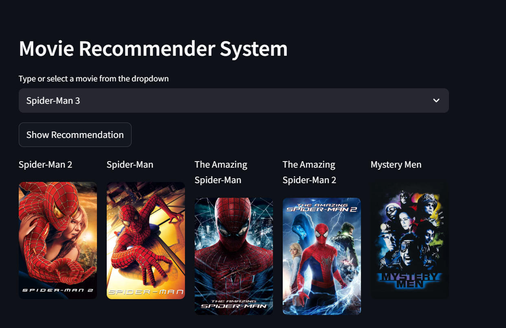

# 🎬 Content-Based Movie Recommendation System

Project Overview:
This is a content-based movie recommendation system built with Python and Streamlit. It suggests movies similar to a selected movie by comparing movie features such as genre, keywords, cast, and crew. Recommendations are generated using a precomputed similarity matrix based on these metadata features, and the app displays the top 5 recommended movies along with their posters in a clean and interactive web interface.

✨ Key Features
Content-based recommendations using movie metadata (genre, keywords, cast, crew)
Interactive and responsive UI using Streamlit
Dynamic poster retrieval from The Movie Database (TMDB) API
Fast recommendations using cosine similarity and precomputed similarity matrix
Easy to use: just select a movie and get recommendations
### Demo Screenshot ⚡

## Deployment
This Movie Recommendation System project is deployed live using Streamlit, allowing anyone to explore and interact with the app directly from a web browser. Streamlit is a powerful Python framework that makes it easy to create and share beautiful, interactive web applications for data science and machine learning projects.
The application provides a content-based movie recommendation system using genres, keywords, cast, and crew information. Users can input a movie, and the app instantly suggests similar movies along with their posters for a smooth and engaging experience.
You can try the live app here: https://49lgybtk94timewwkj94jk.streamlit.app
## Challenges Faced
Feature Engineering: Combining genre, keywords, cast, and crew into a single feature set for similarity calculation was challenging.
Data Cleaning: Handling missing or inconsistent metadata (e.g., missing cast info or keywords) required careful preprocessing.
Poster Fetching: Ensuring that posters from TMDB API load correctly, even when some movies do not have poster images.
Performance Optimization: Precomputing similarity matrices was necessary to ensure fast recommendations in the app.
Streamlit Deployment: Managing dependency conflicts, ensuring smooth app loading, and making the interface user-friendly.

## Conclusion
This Content-Based Movie Recommendation System demonstrates how combining multiple metadata features into a single tags column and leveraging transformer-based embeddings can create meaningful and accurate movie recommendations. By using cosine similarity, the app delivers fast and relevant suggestions in an interactive interface. The project highlights the importance of data preprocessing, feature integration, and semantic vectorization when building practical machine learning applications.
